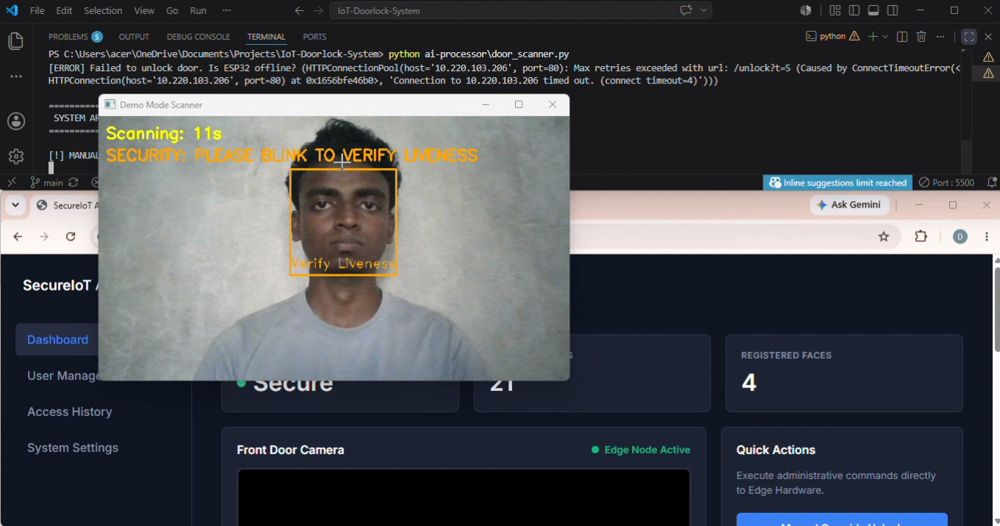
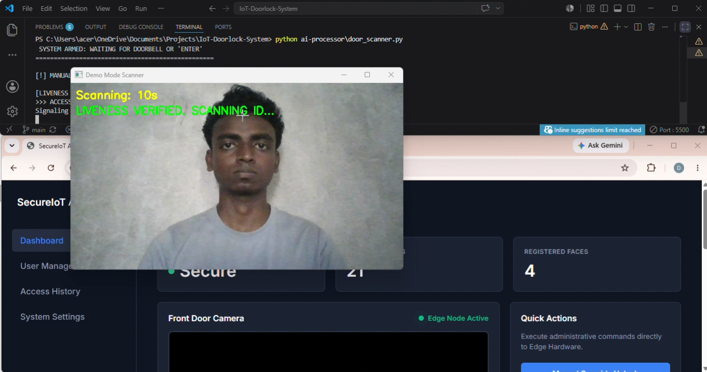
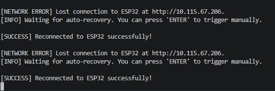
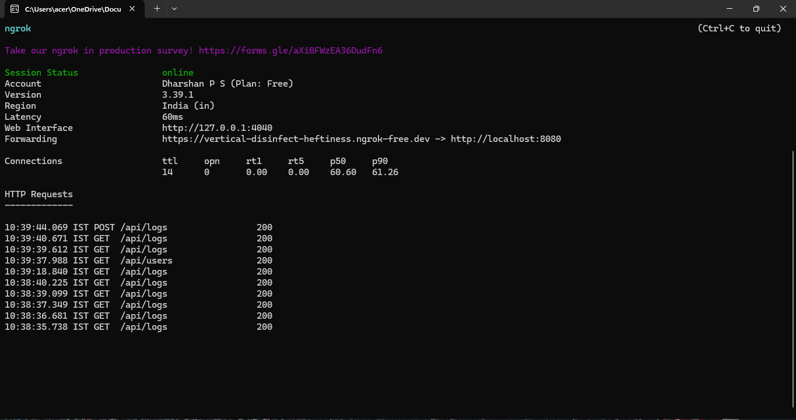

# IoT Smart Authentication System 🔐

A high-performance, end-to-end facial recognition entry control system designed to bridge edge microcontrollers with secure enterprise web architectures.

This project was built by a specialized engineering team of 4. As the **Lead Full-Stack Developer**, I took sole ownership of the software lifecycles, database structures, and the critical networking infrastructure required to bridge physical hardware with cloud backend systems.

## ⚡ Core Architecture & My System Ownership

Rather than focus on edge microcontroller firmware or client mobile apps, my responsibility was engineering the centralized coordination layers that power the system:

- **Hardware-to-Backend Integration:** Architected the network communication protocols (Socket/HTTP streams) that allowed the physical edge cameras to securely stream authentication data packets to our servers.
- **Central Server Engine:** Programmed the core Java-based server designed to asynchronously ingest hardware payloads, execute rapid validation routines, and coordinate system responses.
- **Relational Database Management:** Designed and deployed a robust, normalized MySQL schema optimized to instantly index, store, and retrieve real-time access logs and identity metadata without logging bottlenecks.
- **Administrative Web Command Center:** Built a responsive frontend dashboard from scratch using vanilla JavaScript, HTML5, and CSS3 to consume backend REST APIs, providing security personnel with live access telemetry.

## 🛠️ Software Tech Stack

- **Language/Runtime:** Core Java (Server Processing Logic)
- **Backend Framework:** Custom REST API Endpoints & Sockets
- **Database:** MySQL (Relational Schema & Aggregations)
- **Frontend:** Vanilla JavaScript (ES6+), HTML5, CSS3
- **Tools:** Git/GitHub, VS Code

## 🖥️ System Telemetry & Software Resilience

Because the physical edge devices operate on local hardware networks, the system's architecture and backend resilience are demonstrated via server telemetry, API routing, and recognition logs.

### 1. Advanced Liveness Detection & UI Dashboard

_(Demonstrating the computer vision module executing an anti-spoofing "blink" check before verifying the ID against the database, overlaying the custom React/JS dashboard)._

  
  &nbsp; &nbsp;
  

### 2. Network Resilience & Auto-Recovery

_IoT edge devices frequently drop connections. I engineered a robust auto-recovery loop that detects HTTP timeouts, catches the connection exception, and automatically re-establishes the socket connection with the ESP32 without crashing the backend server._

  

### 3. Secure API Routing via ngrok

_Demonstrating real-time HTTP request processing. The server actively handles `GET` and `POST` requests to the `/api/logs` endpoints, securely tunneling local server traffic for remote administrative access._

  

## 🚀 Key Engineering Accomplishments

1. **Payload Parsing Optimization:** Established structured data contracts between hardware edge devices and Java, ensuring high-throughput validation under 50ms.
2. **Real-Time Data Streaming:** Leveraged asynchronous JavaScript processing to dynamically update administrative access logs via DOM manipulation without requiring full-page refreshes.
3. **Data Integrity & Normalization:** Implemented relational foreign keys to maintain strict security compliance across historical entry tracking ledgers.
