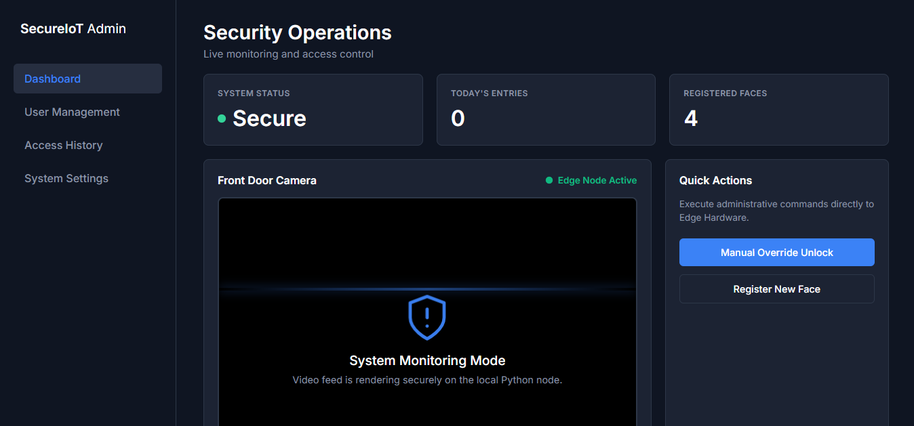
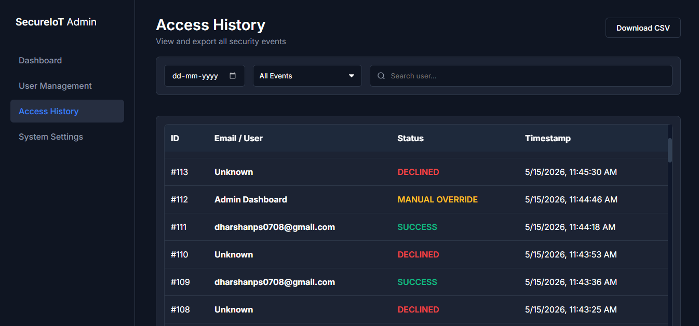

# IoT Smart Authentication System 🔐

A high-performance, end-to-end facial recognition entry control system designed to bridge edge microcontrollers with secure enterprise web architectures. 

This project was built by a specialized engineering team of 4. As the **Lead Full-Stack Developer**, I took sole ownership of the software lifecycles, database structures, and the critical networking infrastructure required to bridge physical hardware with cloud backend systems.

## ⚡ Core Architecture & My System Ownership

Rather than focus on edge microcontroller firmware or client mobile apps, my responsibility was engineering the centralized coordination layers that power the system:

* **Hardware-to-Backend Integration:** Architected the network communication protocols (Socket/HTTP streams) that allowed the physical edge cameras to securely stream authentication data packets to our servers.
* **Central Server Engine:** Programmed the core Java-based server designed to asynchronously ingest hardware payloads, execute rapid validation routines, and coordinate system responses.
* **Relational Database Management:** Designed and deployed a robust, normalized MySQL schema optimized to instantly index, store, and retrieve real-time access logs and identity metadata without logging bottlenecks.
* **Administrative Web Command Center:** Built a responsive frontend dashboard from scratch using vanilla JavaScript, HTML5, and CSS3 to consume backend REST APIs, providing security personnel with live access telemetry.

## 🛠️ Software Tech Stack
* **Language/Runtime:** Core Java (Server Processing Logic)
* **Backend Framework:** Custom REST API Endpoints & Sockets
* **Database:** MySQL (Relational Schema & Aggregations)
* **Frontend:** Vanilla JavaScript (ES6+), HTML5, CSS3
* **Tools:** Git/GitHub, VS Code

## 🖥️ System Architecture & UI Demo

Because the physical edge devices are deployed, this repository highlights the software architecture using decoupled API testing.

### 1. Full-Stack Data Pipeline Demo
*(Demonstrating the Java server receiving a mocked edge-device payload and instantly updating the React/JS administrative dashboard via WebSocket/API).*

  

### 2. Custom Administrative Dashboard
*Re-engineered the edge-device streaming interface to include real-time telemetry, access logs, and a modernized UI.*

  

  

## 🚀 Key Engineering Accomplishments
1. **Payload Parsing Optimization:** Established structured data contracts between hardware edge devices and Java, ensuring high-throughput validation under 50ms.
2. **Real-Time Data Streaming:** Leveraged asynchronous JavaScript processing to dynamically update administrative access logs via DOM manipulation without requiring full-page refreshes.
3. **Data Integrity & Normalization:** Implemented relational foreign keys to maintain strict security compliance across historical entry tracking ledgers.